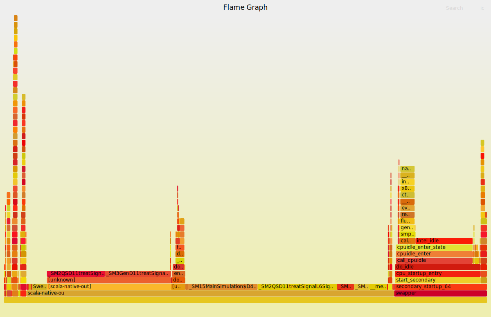

# Simulation Benchmarks 

Here you can find benchmarks of stochastic discrete event simulation using different runtime environments, currently including Java, Scala 2, and Scala Native.


Summary of results:
* The Java and Scala on JVM are performing equal. This is not surprising as the underlying runtime is the JVM and the byte code generated should be similar.
* Scala Native is around 70% faster (sic!) in this use case. This is a significant speed-up and preliminary investigations gives a hint that the new commix garbage collector is part of the explanation of this extraordinary speedup.
* Disclaimer: The benchmark is still "naive" as it is includes one single data-point. Further simulations are needed to investigate the impact of JVM warmup including the run-time optimizations that JIT provides. Each run show a statistical variation that needs to be characterized using averaging over multiple runs. Etc Etc.  

## How to run 
Navigate to the sub-folders of the different benchmarks (java, scala2, scala-native) and then fire up `sbt` and type `run`.

Scala Native is more than 70% faster!  

NOTE: [Scala native](http://www.scala-native.org) does not, at the time of writing, support Windows. You need Linux or macos.

### Java:
```
sbt:java> run
[info] running (fork) MainSimulation 
Execution time: 0.693 seconds
Mean number of customers in queuing system: 3.5019126434482586
```
### Scala 2:
```
sbt:scala2> run
[info] running (fork) MainSimulation 
Execution time: 0.695 seconds
Mean number of customers in queuing system: 3.4850718010252866
```
### Scala Native 
```
sbt:scala-native> run
[info] Linking (662 ms)
[info] Discovered 969 classes and 7882 methods
[info] Optimizing (release-fast mode) (2947 ms)
[info] Generating intermediate code (809 ms)
[info] Produced 8 files
[info] Compiling to native code (1276 ms)
[info] Linking native code (commix gc, thin lto) (6400 ms)
[info] Total (12137 ms)
Execution time: 0.397 seconds
Mean number of customers in queuing system: 3.5100252092689312
```

You can see a flame graph below of the above execution using Scala natives super fast garbage collector commix.
Download [this svg](https://github.com/lunduniversity/scalades/raw/main/benchmark/scala-native/kernel-GC-commix.svg) to your local machine and open it in your browser to enable interactive zooming.


The corresponding flame graph with no garbage collection is [available here](https://github.com/lunduniversity/scalades/raw/main/benchmark/scala-native/kernel-GC-none.svg) (`GC.none` in `build.sbt` employ a dummy GC where memory is allocated until out of memory)

## Credit

The Java code was originally developed by Christian Nyberg. The Java version was ported to Scala 2 by Björn Regnell, keeping as close to the Java variant as possible enabling "fair" performance comparison. The Scala 2 is thus not idiomatic Scala, but just a direct translation of "java in scala".
